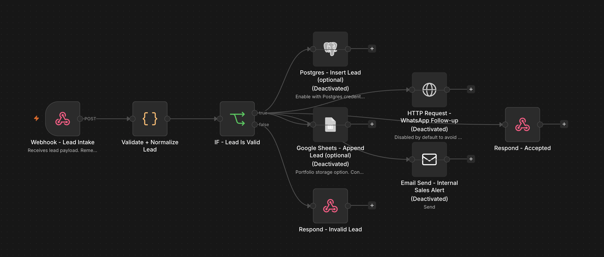
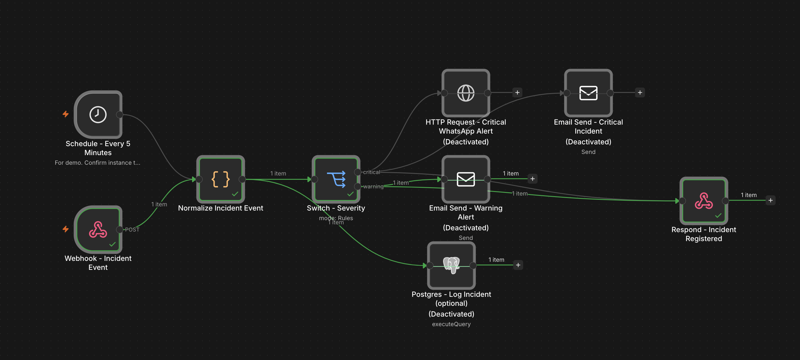

# Portfolio n8n Automations — Oscar Haunau

## Portfolio de automatizaciones n8n para marketing, ventas y operaciones

Estos son dos proyectos prácticos de automatización con n8n, pensados para agencias y equipos que necesitan reducir trabajo manual, responder más rápido a los leads y mantener control sobre procesos internos.

**English:** Two practical n8n automation projects for agencies and teams that need to reduce manual work, respond faster to leads, and keep internal operations under control.

<p align="center">
  
  
</p>

## Qué hacen estos workflows, en palabras simples

### 1. Lead Intake + WhatsApp + CRM

Este workflow recibe consultas de potenciales clientes automáticamente.

Por ejemplo: alguien completa un formulario en una landing page. n8n recibe los datos, valida que estén correctos, organiza la información, calcula si el lead es de alta prioridad y lo deja listo para seguimiento comercial.

Puede:

- Guardar el lead en Google Sheets o PostgreSQL.
- Avisar al equipo comercial por email.
- Enviar un mensaje automático de seguimiento por WhatsApp.

**Resumen:**

> Automatización para recibir leads desde formularios, validar datos, guardarlos en un CRM o base de datos y disparar seguimiento automático por WhatsApp/email. Reduce tareas manuales y mejora la velocidad de respuesta comercial.

**English:**

> Automation for capturing leads from forms, validating data, registering them in a CRM or database, and triggering automatic WhatsApp/email follow-up. It reduces manual workload and improves commercial response speed.

### 2. Operational Alerts + Incident Escalation

Este workflow detecta problemas operativos y avisa rápido al equipo correspondiente.

Por ejemplo: si una API falla, un sistema se demora, un proveedor externo responde mal o un proceso interno queda trabado, n8n recibe el evento, lo clasifica como warning o critical y genera una alerta.

Puede:

- Registrar el incidente.
- Notificar al equipo por email o WhatsApp.
- Definir prioridad.
- Asignar un tiempo de respuesta/SLA.
- Escalar problemas críticos.

**Resumen:**

> Automatización para registrar eventos operativos, clasificar incidentes por severidad y disparar alertas por email/WhatsApp con lógica de SLA. Sirve para soporte técnico, back-office y monitoreo de servicios.

**English:**

> Automation for registering operational events, classifying incidents by severity, and triggering email/WhatsApp alerts with SLA logic. It is designed for technical support, back-office operations and service monitoring.

## Por qué esto aporta valor a una agencia de marketing

- Respuesta más rápida a leads entrantes.
- Menos carga manual entre formularios, planillas y CRMs.
- Mejor trazabilidad de oportunidades comerciales.
- Alertas claras cuando fallan procesos internos o proveedores.
- Workflows n8n prácticos, adaptables a clientes reales.

**English:**

- Faster response to incoming leads.
- Less manual copy-paste between forms, sheets and CRMs.
- Better traceability of commercial opportunities.
- Clear alerts when internal processes or providers fail.
- Practical n8n workflows that can be adapted to real clients.

## Projects

1. **Lead Intake + WhatsApp + CRM**
   - Captures leads via Webhook.
   - Validates and normalizes contact data.
   - Scores lead priority.
   - Stores the lead in Google Sheets or PostgreSQL.
   - Triggers WhatsApp follow-up and internal email notification.

2. **Operational Alerts + Incident Escalation**
   - Receives incident events by Webhook or runs scheduled health-check demo.
   - Normalizes event data and classifies severity.
   - Logs incidents.
   - Sends alerts by WhatsApp/email and supports SLA escalation logic.

## Portfolio positioning

These workflows demonstrate practical automation skills: Webhooks, conditional routing, data normalization, API calls, CRM-style persistence, WhatsApp/email notifications, logs, SLA thinking, and safe use of environment variables.

## Import

In n8n: **Workflows → Import from File** and select each `workflow.n8n.json`.

External action nodes are disabled by default to prevent accidental real messages. Configure credentials/environment values, then enable the nodes you want to demo.

## Tested locally

Both workflows were imported and tested on a local n8n instance running at `http://localhost:5678`.

### Lead Intake + WhatsApp + CRM

Valid lead test:

```bash
curl -X POST "http://localhost:5678/webhook-test/portfolio/lead-intake" \
  -H "Content-Type: application/json" \
  -d @"/Users/oscarhaunau/Documents/Postulaciones/Moon/portfolio-n8n-automations/lead-intake-whatsapp-crm/sample-payload.json"
```

Expected response:

```json
{
  "status": "accepted",
  "trace_id": "lead_...",
  "priority": "hot",
  "message": "Lead received and queued for follow-up"
}
```

Invalid lead test:

```bash
curl -X POST "http://localhost:5678/webhook-test/portfolio/lead-intake" \
  -H "Content-Type: application/json" \
  -d @"/Users/oscarhaunau/Documents/Postulaciones/Moon/portfolio-n8n-automations/lead-intake-whatsapp-crm/sample-invalid-payload.json"
```

Expected response:

```json
{
  "status": "error",
  "message": "Invalid lead payload",
  "errors": ["Missing name", "Invalid email", "Invalid phone"]
}
```

### Operational Alerts + Incident Escalation

Critical incident test:

```bash
curl -X POST "http://localhost:5678/webhook-test/portfolio/incident-event" \
  -H "Content-Type: application/json" \
  -d @"/Users/oscarhaunau/Documents/Postulaciones/Moon/portfolio-n8n-automations/operational-alerts-incidents/sample-critical-event.json"
```

Expected response:

```json
{
  "status": "registered",
  "incident_id": "inc_...",
  "severity": "critical",
  "sla_minutes": 15
}
```

Warning incident test:

```bash
curl -X POST "http://localhost:5678/webhook-test/portfolio/incident-event" \
  -H "Content-Type: application/json" \
  -d @"/Users/oscarhaunau/Documents/Postulaciones/Moon/portfolio-n8n-automations/operational-alerts-incidents/sample-warning-event.json"
```

Expected response:

```json
{
  "status": "registered",
  "incident_id": "inc_...",
  "severity": "warning",
  "sla_minutes": 60
}
```

> Note: The external action nodes for WhatsApp, email, Google Sheets and PostgreSQL are disabled by default to avoid sending real messages or writing to real services without credentials.
