# Portfolio n8n Automations — Oscar Haunau

<p align="center">
  
  
</p>

<p align="center">
  <a href="#español"><strong>🇪🇸 Español</strong></a> ·
  <a href="#english"><strong>🇺🇸 English</strong></a>
</p>

---

## Español

## Automatizaciones n8n para marketing, ventas y operaciones

Estos son dos proyectos prácticos de automatización con n8n, pensados para agencias y equipos que necesitan reducir trabajo manual, responder más rápido a los leads y mantener control sobre procesos internos.

## Qué hacen estos workflows, en palabras simples

### 1. Lead Intake + WhatsApp + CRM

Este workflow recibe consultas de potenciales clientes automáticamente.

Por ejemplo: alguien completa un formulario en una landing page. n8n recibe los datos, valida que estén correctos, organiza la información, calcula si el lead es de alta prioridad y lo deja listo para seguimiento comercial.

Puede:

- Guardar el lead en Google Sheets o PostgreSQL.
- Avisar al equipo comercial por email.
- Enviar un mensaje automático de seguimiento por WhatsApp.

**Resumen:**

> Automatización para recibir leads desde formularios, validar datos, guardarlos en un CRM o base de datos y disparar seguimiento automático por WhatsApp/email. Reduce tareas manuales y mejora la velocidad de respuesta comercial.

### 2. Operational Alerts + Incident Escalation

Este workflow detecta problemas operativos y avisa rápido al equipo correspondiente.

Por ejemplo: si una API falla, un sistema se demora, un proveedor externo responde mal o un proceso interno queda trabado, n8n recibe el evento, lo clasifica como warning o critical y genera una alerta.

Puede:

- Registrar el incidente.
- Notificar al equipo por email o WhatsApp.
- Definir prioridad.
- Asignar un tiempo de respuesta/SLA.
- Escalar problemas críticos.

**Resumen:**

> Automatización para registrar eventos operativos, clasificar incidentes por severidad y disparar alertas por email/WhatsApp con lógica de SLA. Sirve para soporte técnico, back-office y monitoreo de servicios.

## Por qué esto aporta valor?

- Respuesta más rápida a leads entrantes.
- Menos carga manual entre formularios, planillas y CRMs.
- Mejor trazabilidad de oportunidades comerciales.
- Alertas claras cuando fallan procesos internos o proveedores.
- Workflows n8n prácticos, adaptables a clientes reales.

## Proyectos

1. **Lead Intake + WhatsApp + CRM**
   - Captura leads vía Webhook.
   - Valida y normaliza datos de contacto.
   - Calcula prioridad del lead.
   - Guarda el registro en Google Sheets o PostgreSQL.
   - Dispara seguimiento por WhatsApp y notificación interna por email.

2. **Operational Alerts + Incident Escalation**
   - Recibe eventos por Webhook o ejecuta una demo con Schedule Trigger.
   - Normaliza datos del evento y clasifica severidad.
   - Registra incidentes.
   - Envía alertas por WhatsApp/email y soporta lógica de escalamiento por SLA.

## Posicionamiento de portfolio

Estos workflows demuestran habilidades prácticas de automatización: Webhooks, rutas condicionales, normalización de datos, llamadas API, persistencia tipo CRM, notificaciones por WhatsApp/email, logs, criterios de SLA y uso seguro de variables de entorno.

## Cómo importar

En n8n: **Workflows → Import from File** y seleccionar cada archivo `workflow.n8n.json`.

Los nodos de acciones externas están desactivados por defecto para evitar mensajes reales o escrituras en servicios reales. Configurá credenciales/variables de entorno antes de habilitarlos.

## Probado localmente

Ambos workflows fueron importados y probados en una instancia local de n8n corriendo en `http://localhost:5678`.

### Lead Intake + WhatsApp + CRM

Prueba de lead válido:

```bash
curl -X POST "http://localhost:5678/webhook-test/portfolio/lead-intake" \
  -H "Content-Type: application/json" \
  -d @"/Users/oscarhaunau/Documents/Postulaciones/Moon/portfolio-n8n-automations/lead-intake-whatsapp-crm/sample-payload.json"
```

Respuesta esperada:

```json
{
  "status": "accepted",
  "trace_id": "lead_...",
  "priority": "hot",
  "message": "Lead received and queued for follow-up"
}
```

Prueba de lead inválido:

```bash
curl -X POST "http://localhost:5678/webhook-test/portfolio/lead-intake" \
  -H "Content-Type: application/json" \
  -d @"/Users/oscarhaunau/Documents/Postulaciones/Moon/portfolio-n8n-automations/lead-intake-whatsapp-crm/sample-invalid-payload.json"
```

Respuesta esperada:

```json
{
  "status": "error",
  "message": "Invalid lead payload",
  "errors": ["Missing name", "Invalid email", "Invalid phone"]
}
```

### Operational Alerts + Incident Escalation

Prueba de incidente crítico:

```bash
curl -X POST "http://localhost:5678/webhook-test/portfolio/incident-event" \
  -H "Content-Type: application/json" \
  -d @"/Users/oscarhaunau/Documents/Postulaciones/Moon/portfolio-n8n-automations/operational-alerts-incidents/sample-critical-event.json"
```

Respuesta esperada:

```json
{
  "status": "registered",
  "incident_id": "inc_...",
  "severity": "critical",
  "sla_minutes": 15
}
```

Prueba de incidente warning:

```bash
curl -X POST "http://localhost:5678/webhook-test/portfolio/incident-event" \
  -H "Content-Type: application/json" \
  -d @"/Users/oscarhaunau/Documents/Postulaciones/Moon/portfolio-n8n-automations/operational-alerts-incidents/sample-warning-event.json"
```

Respuesta esperada:

```json
{
  "status": "registered",
  "incident_id": "inc_...",
  "severity": "warning",
  "sla_minutes": 60
}
```


### Integración real con Google Sheets

También se probó la integración real con Google Sheets usando autenticación por **Service Account**. El workflow guarda automáticamente el lead validado en una planilla real.

<p align="center">
  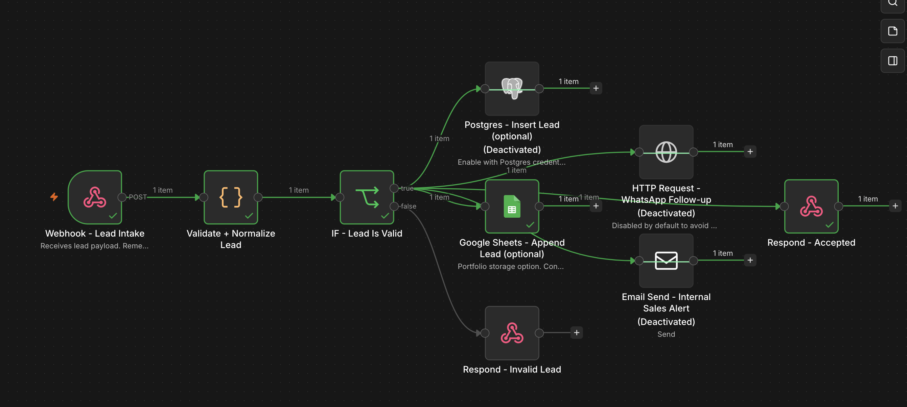
</p>

### Envío real de email con Gmail SMTP

También se probó el envío real de email usando **Gmail SMTP** con contraseña de aplicación. Después de recibir y validar el lead, el workflow envía una notificación comercial por email con los datos principales del contacto.

<p align="center">
  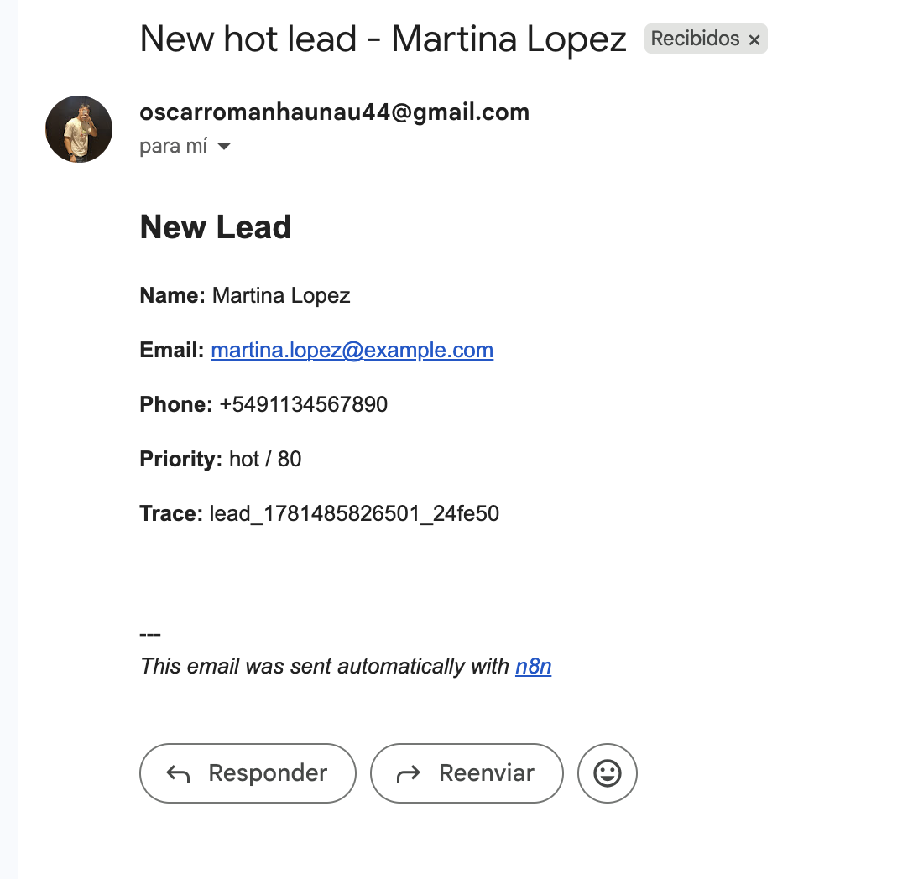
</p>

### Evidencia visual del flujo completo

Capturas adicionales del flujo probado end-to-end: ejecución del webhook, escritura en Google Sheets y notificación por email.

<p align="center">
  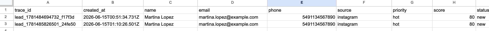
</p>

<p align="center">
  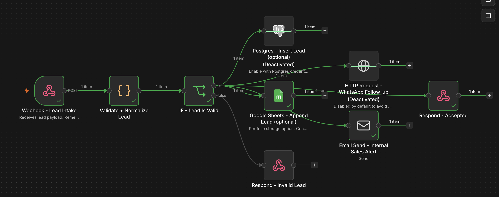
</p>

<p align="center">
  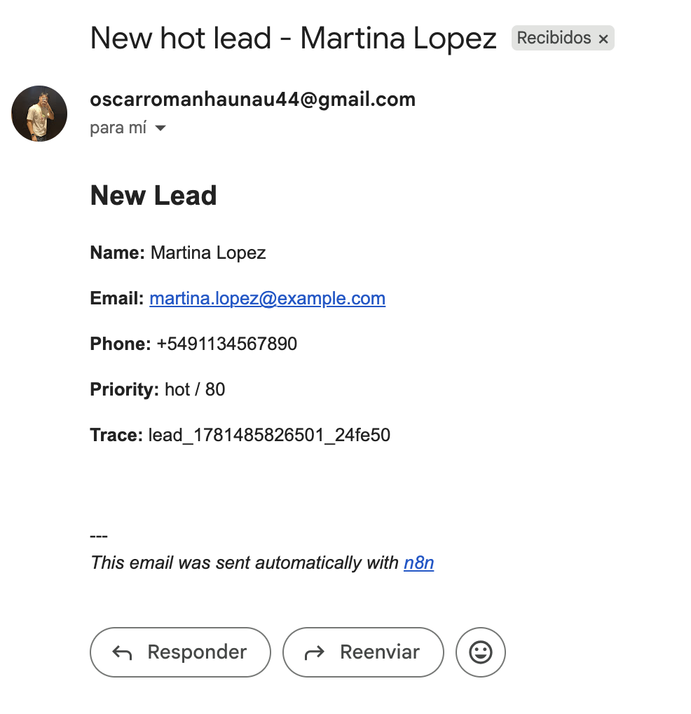
</p>

### Alertas reales de incidentes por Gmail SMTP

También se probaron las alertas del workflow de incidentes usando **Gmail SMTP** para los casos `critical` y `warning`. El flujo clasifica la severidad, asigna SLA y envía el email correspondiente.

<p align="center">
  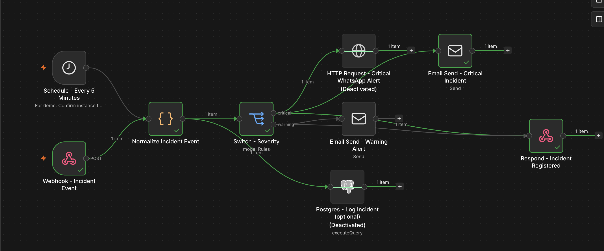
</p>

<p align="center">
  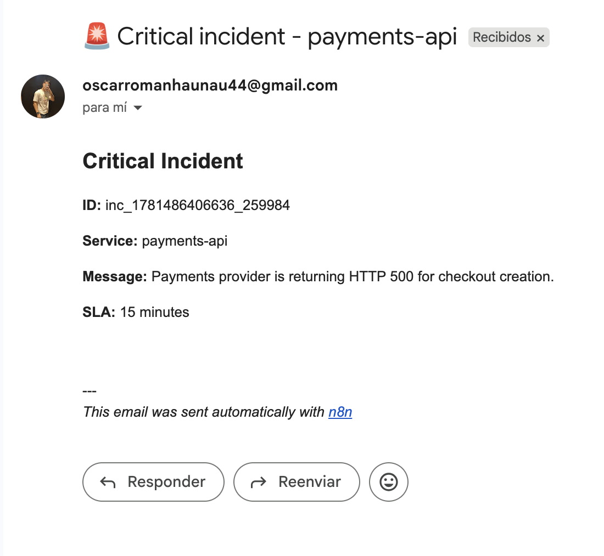
</p>

<p align="center">
  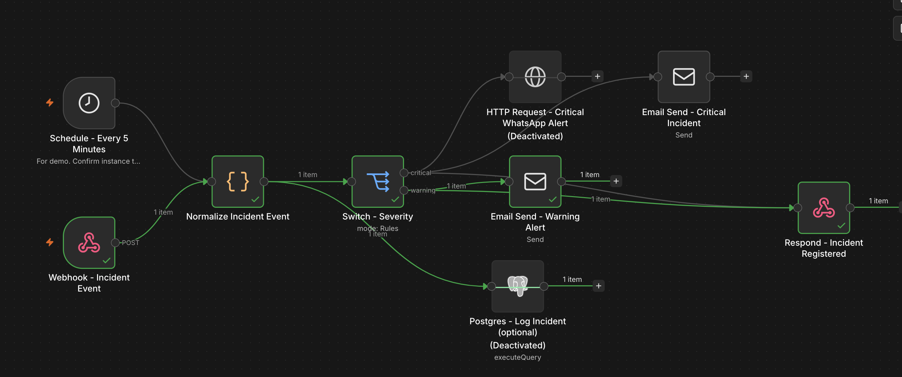
</p>

<p align="center">
  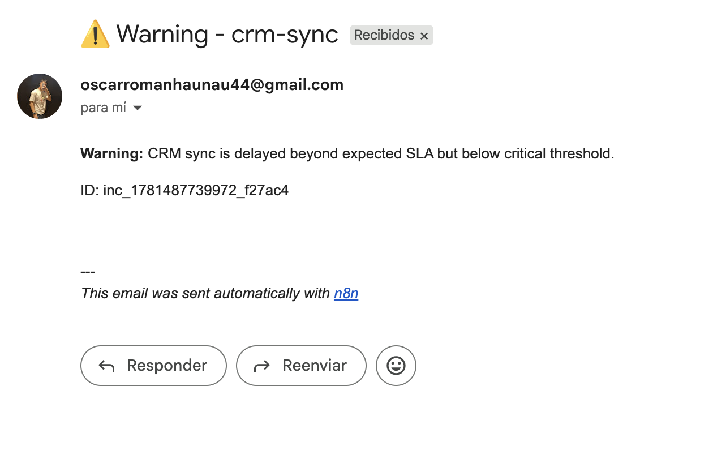
</p>

### Evidencia adicional de alertas operativas

Capturas adicionales del flujo de incidentes probado con alertas reales por email para eventos `critical` y `warning`.

<p align="center">
  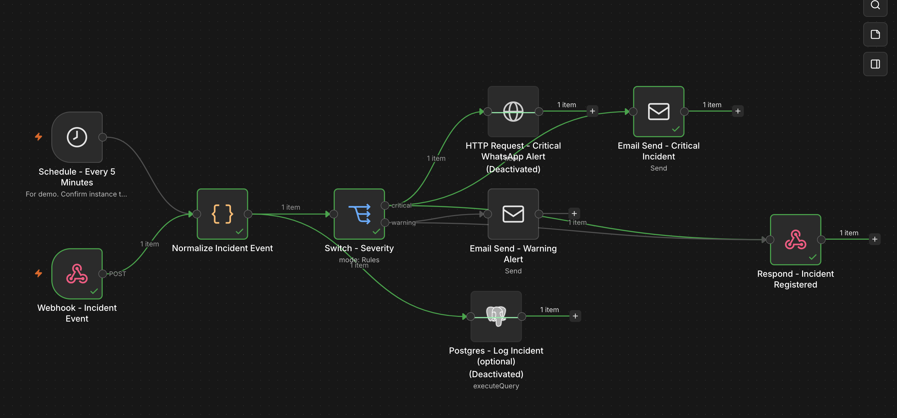
</p>

<p align="center">
  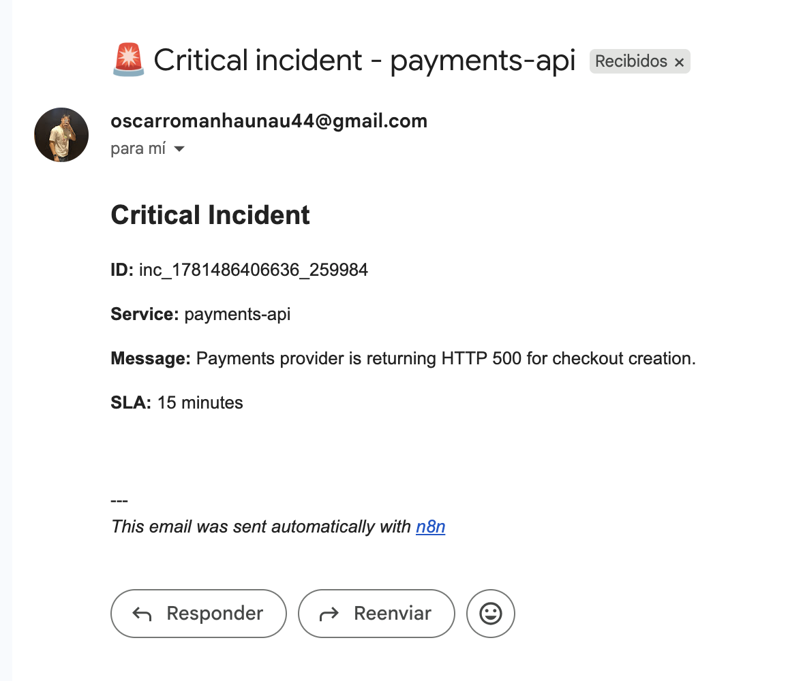
</p>

<p align="center">
  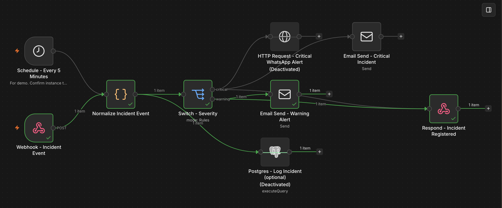
</p>

<p align="center">
  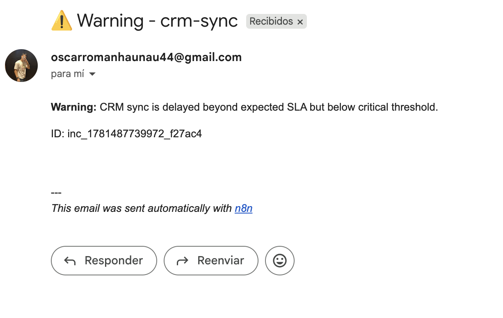
</p>

> Nota: los nodos externos de WhatsApp, email, Google Sheets y PostgreSQL están desactivados por defecto para evitar envíos reales o escrituras reales sin credenciales.

---

## English

## n8n automation portfolio for marketing, sales and operations

These are two practical n8n automation projects for agencies and teams that need to reduce manual work, respond faster to leads, and keep internal operations under control.

## What these workflows do, in simple terms

### 1. Lead Intake + WhatsApp + CRM

This workflow receives potential customer inquiries automatically.

For example: someone fills out a form on a landing page. n8n receives the data, checks that it is valid, organizes the information, calculates if the lead is high priority, and prepares it for commercial follow-up.

It can:

- Save the lead in Google Sheets or PostgreSQL.
- Notify the sales team by email.
- Send an automatic WhatsApp follow-up message.

**Summary:**

> Automation for capturing leads from forms, validating data, registering them in a CRM or database, and triggering automatic WhatsApp/email follow-up. It reduces manual workload and improves commercial response speed.

### 2. Operational Alerts + Incident Escalation

This workflow detects operational problems and alerts the right team quickly.

For example: if an API fails, a system is delayed, an external provider responds incorrectly, or an internal process is stuck, n8n receives the event, classifies it as warning or critical, and generates an alert.

It can:

- Register the incident.
- Notify the team by email or WhatsApp.
- Define priority.
- Assign an SLA response time.
- Escalate critical issues.

**Summary:**

> Automation for registering operational events, classifying incidents by severity, and triggering email/WhatsApp alerts with SLA logic. It is designed for technical support, back-office operations and service monitoring.

## Why this adds value?

- Faster response to incoming leads.
- Less manual copy-paste between forms, sheets and CRMs.
- Better traceability of commercial opportunities.
- Clear alerts when internal processes or providers fail.
- Practical n8n workflows that can be adapted to real clients.

## Projects

1. **Lead Intake + WhatsApp + CRM**
   - Captures leads via Webhook.
   - Validates and normalizes contact data.
   - Scores lead priority.
   - Stores the lead in Google Sheets or PostgreSQL.
   - Triggers WhatsApp follow-up and internal email notification.

2. **Operational Alerts + Incident Escalation**
   - Receives incident events by Webhook or runs scheduled health-check demo.
   - Normalizes event data and classifies severity.
   - Logs incidents.
   - Sends alerts by WhatsApp/email and supports SLA escalation logic.

## Portfolio positioning

These workflows demonstrate practical automation skills: Webhooks, conditional routing, data normalization, API calls, CRM-style persistence, WhatsApp/email notifications, logs, SLA thinking, and safe use of environment variables.

## Import

In n8n: **Workflows → Import from File** and select each `workflow.n8n.json`.

External action nodes are disabled by default to prevent accidental real messages. Configure credentials/environment values, then enable the nodes you want to demo.

## Tested locally

Both workflows were imported and tested on a local n8n instance running at `http://localhost:5678`.

### Lead Intake + WhatsApp + CRM

Valid lead test:

```bash
curl -X POST "http://localhost:5678/webhook-test/portfolio/lead-intake" \
  -H "Content-Type: application/json" \
  -d @"/Users/oscarhaunau/Documents/Postulaciones/Moon/portfolio-n8n-automations/lead-intake-whatsapp-crm/sample-payload.json"
```

Expected response:

```json
{
  "status": "accepted",
  "trace_id": "lead_...",
  "priority": "hot",
  "message": "Lead received and queued for follow-up"
}
```

Invalid lead test:

```bash
curl -X POST "http://localhost:5678/webhook-test/portfolio/lead-intake" \
  -H "Content-Type: application/json" \
  -d @"/Users/oscarhaunau/Documents/Postulaciones/Moon/portfolio-n8n-automations/lead-intake-whatsapp-crm/sample-invalid-payload.json"
```

Expected response:

```json
{
  "status": "error",
  "message": "Invalid lead payload",
  "errors": ["Missing name", "Invalid email", "Invalid phone"]
}
```

### Operational Alerts + Incident Escalation

Critical incident test:

```bash
curl -X POST "http://localhost:5678/webhook-test/portfolio/incident-event" \
  -H "Content-Type: application/json" \
  -d @"/Users/oscarhaunau/Documents/Postulaciones/Moon/portfolio-n8n-automations/operational-alerts-incidents/sample-critical-event.json"
```

Expected response:

```json
{
  "status": "registered",
  "incident_id": "inc_...",
  "severity": "critical",
  "sla_minutes": 15
}
```

Warning incident test:

```bash
curl -X POST "http://localhost:5678/webhook-test/portfolio/incident-event" \
  -H "Content-Type: application/json" \
  -d @"/Users/oscarhaunau/Documents/Postulaciones/Moon/portfolio-n8n-automations/operational-alerts-incidents/sample-warning-event.json"
```

Expected response:

```json
{
  "status": "registered",
  "incident_id": "inc_...",
  "severity": "warning",
  "sla_minutes": 60
}
```


### Real Google Sheets integration

The Google Sheets integration was also tested with a real spreadsheet using **Service Account** authentication. The workflow automatically stores the validated lead in a real sheet.

<p align="center">
  
</p>

### Real email delivery with Gmail SMTP

Real email delivery was also tested using **Gmail SMTP** with an app password. After receiving and validating the lead, the workflow sends a commercial notification email with the main contact details.

<p align="center">
  
</p>

### Visual evidence of the complete flow

Additional screenshots of the tested end-to-end flow: webhook execution, Google Sheets write, and email notification.

<p align="center">
  
</p>

<p align="center">
  
</p>

<p align="center">
  
</p>

### Real incident alerts through Gmail SMTP

The incident workflow alerts were also tested using **Gmail SMTP** for both `critical` and `warning` cases. The flow classifies severity, assigns SLA, and sends the corresponding email alert.

<p align="center">
  
</p>

<p align="center">
  
</p>

<p align="center">
  
</p>

<p align="center">
  
</p>

### Additional operational alert evidence

Additional screenshots from the incident workflow tested with real email alerts for `critical` and `warning` events.

<p align="center">
  
</p>

<p align="center">
  
</p>

<p align="center">
  
</p>

<p align="center">
  
</p>

> Note: The external action nodes for WhatsApp, email, Google Sheets and PostgreSQL are disabled by default to avoid sending real messages or writing to real services without credentials.
